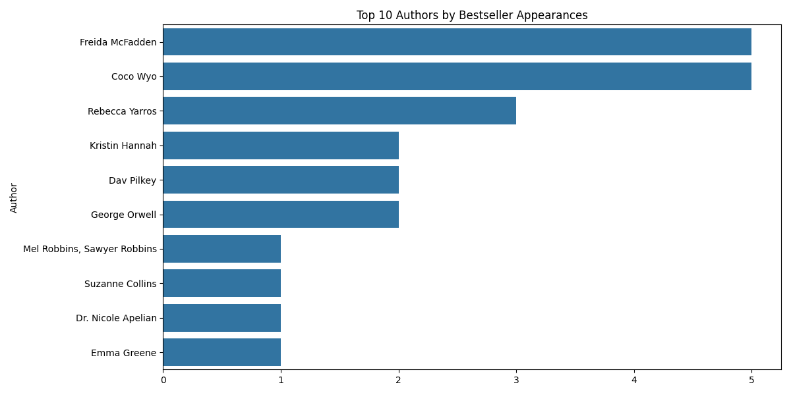
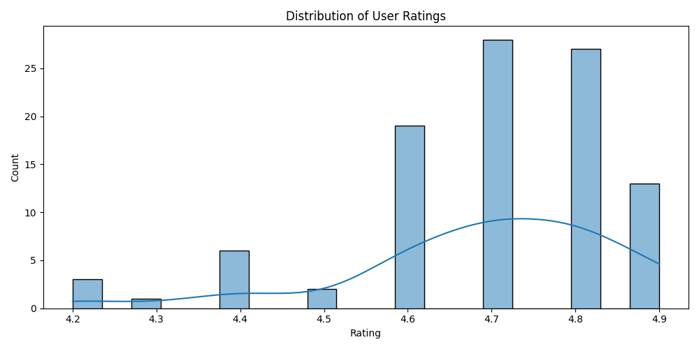
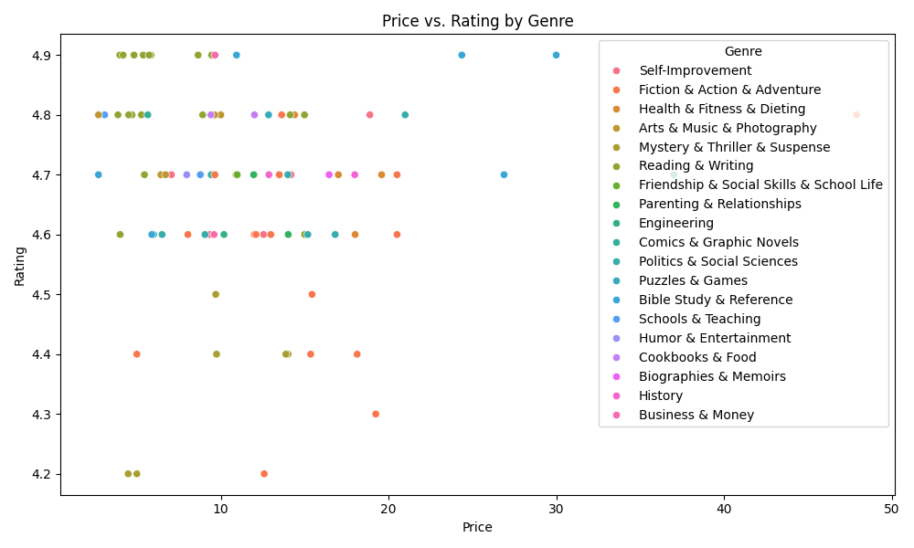
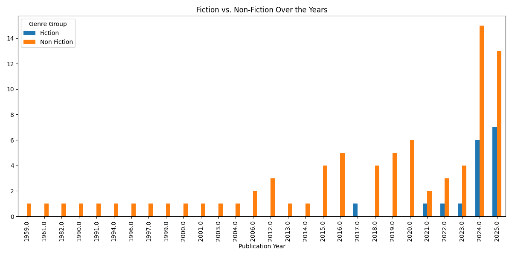

# 📚 Amazon Bestsellers Analysis

An exploratory data analysis (EDA) of Amazon's bestselling books from 2023-2025 using Python, Pandas, and Seaborn.

## 📊 Visualizations

### Top 10 Authors by Bestseller Appearances

### Distribution of User Ratings

### Price vs. Rating by Genre

### Fiction vs. Non-Fiction Over the Years

## 🔍 Key Findings
- Non-Fiction books consistently dominated the bestseller list
- Most books are rated between 4.5 and 5.0
- Price has little correlation with user rating
- A few authors like Jeff Kinney and Gary Chapman appeared repeatedly

## 🛠️ Tools Used
- Python
- Pandas
- Matplotlib
- Seaborn

## ▶️ How to Run
1. Clone the repo
2. Install dependencies: `pip install pandas matplotlib seaborn`
3. Run: `python main.py`
